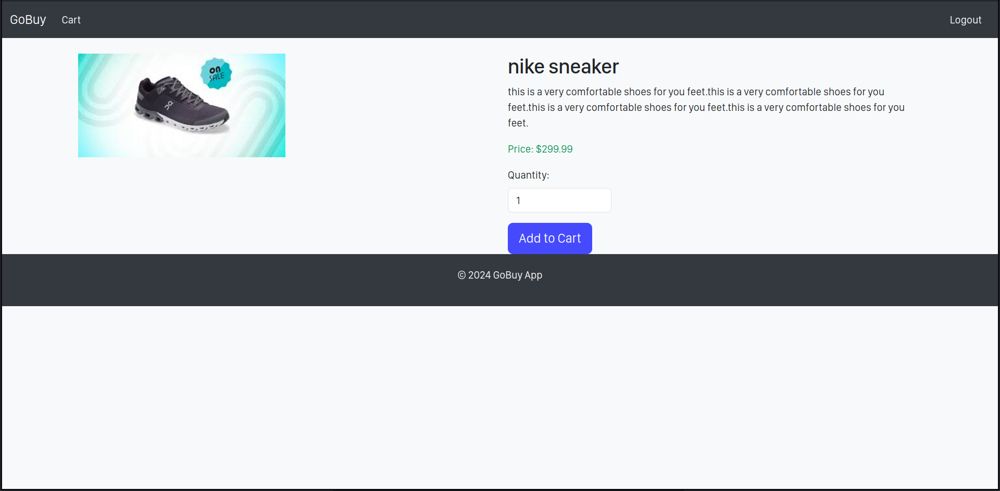

# GoBuy E-commerce Platform

## Introduction

GoBuy is an e-commerce platform that allows users to browse products, add them to the cart, and make purchases. The platform supports user authentication, product management, and order handling.

**Live Project**: [Link to deployed site] (Include when available)

**Blog Post**: [Final project blog article] (Include when available)

**Author**: [LinkedIn](https://www.linkedin.com/in/noble-ch/)

## Installation

To run this project locally, follow these steps:

1. Clone the repository:

   ```
   git clone https://github.com/noblech/gobuy.git
   ```

2. Navigate to the project directory:

   ```
   cd gobuy
   ```

3. Create a virtual environment:

   ```
   python -m venv env
   ```

4. Activate the virtual environment:

   - On Windows:
     ```
     .\env\Scripts\activate
     ```
   - On macOS/Linux:
     ```
     source env/bin/activate
     ```

5. Install the required dependencies:

   ```
   pip install -r requirements.txt
   ```

6. Run the migrations:

   ```
   python manage.py migrate
   ```

7. Start the Django development server:
   ```
   python manage.py runserver
   ```

## Usage

- Register for an account, log in, and start browsing products.
- Add items to your cart and proceed to checkout when ready.

## Contributing

We welcome contributions! Please fork the repository and create a pull request.

## Related Projects

- [Awesome Django E-commerce Project](https://github.com/awesome-django-ecommerce)

## Licensing

This project is licensed under the MIT License. See the LICENSE file for more information.

## Screenshot


